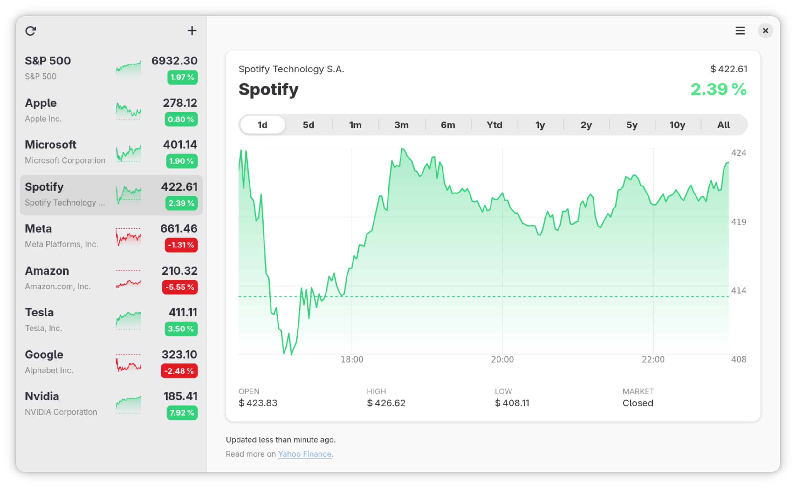

# Stocks

A simple Gnome app for following the stock market at a glance. Meant for casual usage, not for trading.



> [!CAUTION]
> Do not make investment decision only based on this application. Always double check the data from some other source.

> [!IMPORTANT]
All data is fetched from _Yahoo Finance_, but this is completely independent project from Yahoo. The developer or Yahoo is not responsible for any wrong data. Please read the [license](./LICENSE) and especially Disclaimer of Warranty and Limitation of Liability.

## Features
- Search symbols and add them to a watch list
- Reorder watch list items with drag and drop
- Set optional symbol alias by click the symbol name
- Set dark/light mode or follow the system setting
- Hover and select a range on top of the graph to see more details
- Support for mobile

## Build and run

Requirements:
- .NET SDK 9
- Meson (>= 1.5) and Ninja
- blueprint-compiler
- GLib tools: glib-compile-resources and glib-compile-schemas
- GTK4 and libadwaita development packages

Run these commands in project folder:

#### Compile Gsettings schema
```bash
glib-compile-schemas data/
```

#### Build
```bash
dotnet build Stocks.csproj
```

#### Run
```bash
GSETTINGS_SCHEMA_DIR=$PWD/data dotnet run --project Stocks.csproj
```

## Configuration
There are few things that super-user's can configure from command line. There is no UI for these and there won't be. Stocks uses sensible default values and most users should not touch these. If you change any of these settings, you need to restart the app after changing a setting for it to come in effect.

First you need to run `flatpak run --command=sh fi.taimila.Stocks`. After that use `gsettings` command to change a setting and finally finish with `exit`.

### Available settings

#### Update interval
How often app refreshes the data from internet. Default value is every 5 seconds. There is a button on UI that always allows immediate update. To save bandwidth and not to ddos servers for no good reason auto updates are not executed when the market is closed.

```bash
gsettings set fi.taimila.Stocks update-interval 10
```

#### User agent
User agent is used by the HTTP client fetching data from Yahoo Finance. Setting an invalid value will break the app.

```bash
gsettings set fi.taimila.Stocks user-agent "your custom user agent"
```

## Development
Visual Studio Code or Gnome Builder.

For VS Code I recommend using
 * [Flatpak extension](https://github.com/bilelmoussaoui/flatpak-vscode)
 * [Gtk Blueprint extension](https://github.com/bodil/vscode-blueprint)

 ## Acknowledgements
 This project is possible because of many other open source projects out there that have inspired me or which I have used or borrowed some code from.

 * [gir.core](https://gircore.github.io/) C# bindings for GTK enabled this project
 * [Denaro](https://github.com/NickvisionApps/Denaro) app was a great reference code base
 * [Stock Market Monitor for KDE Plasma 6](https://github.com/vpsone/stock-monitor-widget) insprired me to start this project
 * [BlueprintGTK](https://gitlab.gnome.org/tijder/blueprintgtk) has a great Theme Switcher I borrowed to this project.